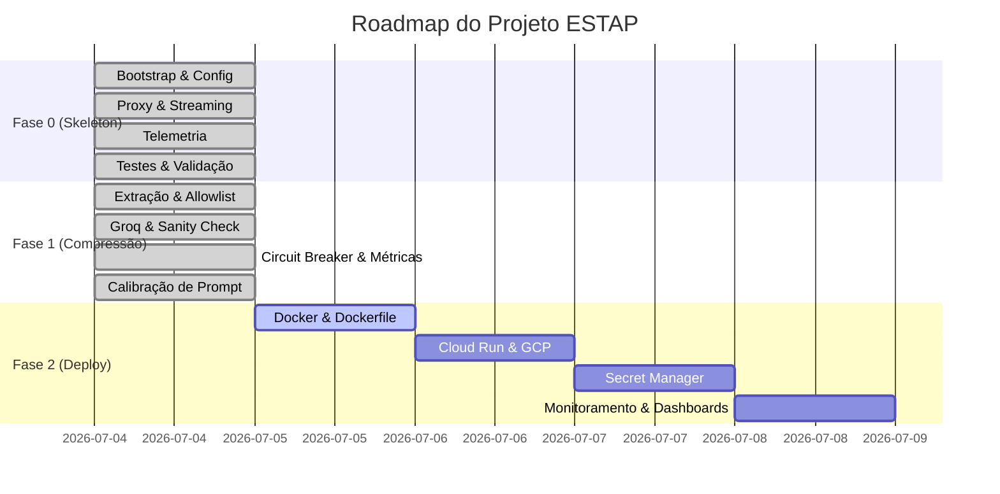

# 📊 ESTAP — Painel de Progresso do Desenvolvimento
Este documento rastreia em tempo real o andamento do desenvolvimento do projeto **Edge-Side Token Arbitrage Proxy (ESTAP)**.

## 🏁 Fase Atual: Fase 2 — Deploy & Operações
**Objetivo:** Containerizar o ESTAP com Docker multi-stage, implantá-lo no Google Cloud Run com scale-to-zero, gerenciar segredos via Secret Manager, configurar monitoramento com Cloud Logging e criar dashboard operacional.

---

## 🗺️ Visão Geral do Roadmap



---

## 📝 Quadro de Tarefas

### 🟢 Sprint 1 — Fase 0: The Walking Skeleton (Concluída)
* [x] **0.7.1 — Arquivos do Gradle:** Criados `build.gradle.kts`, `settings.gradle.kts` e `gradle.properties`.
* [x] **0.7.2 — Ambiente e Ignore:** Criados `.gitignore`, `.env.example` e `.sdkmanrc`.
* [x] **0.7.3 — EnvironmentConfig.java:** Implementado com carregamento robusto via dotenv e validação de tipos.
* [x] **Wrapper do Gradle:** `gradlew` e diretório `gradle/` inicializados com sucesso após reconfiguração do daemon local.
* [x] **0.7.4 — EstapApplication.java:** Servidor Javalin configurado com rotas dinâmicas catch-all e endpoint `/estap/health`.
* [x] **0.7.5 — ProxyController.java:** Criado com lógica para reconstrução da URL de upstream, tratamento de headers e delegação.
* [x] **0.7.6 — StreamingRelay.java (Convencional):** Implementada a requisição síncrona com tratamento de headers e status.
* [x] **0.7.7 — StreamingRelay.java (SSE Streaming):** Adicionado suporte a Server-Sent Events com piping dinâmico e flushing imediato de buffers.
* [x] **0.7.8 — RequestMetrics & MetricsLogger:** Implementados dados imutáveis de requisição e serializador estruturado JSON.
* [x] **0.7.9 — Integração de Métricas:** Injetado rastreamento de latência total e de upstream no controller.
* [x] **0.7.10 — PayloadAnalyzer.java:** Implementada a anatomia de payload sem exposição de valores reais.
* [x] **0.7.11 — Testes Unitários:** Testes de EnvironmentConfig e MetricsLogger implementados e passando.
* [x] **0.7.12 — Testes de Integração com WireMock:** Validada toda a comunicação com upstream, mock de SSE e health checks.
* [x] **0.7.13 — Validação Final (Build Limpo):** Executado `./gradlew build` com sucesso.

### 🟢 Sprint 2 — Fase 1: Motor de Compressão (Concluída)
* [x] **1.13.1 — Configurações do Groq:** Atualizar `EnvironmentConfig` para carregar as chaves e endpoints do Groq.
* [x] **1.13.2 — PromptExtractor.java:** Implementar lógica para localizar o prompt do usuário com base na estrutura identificada no Payload Analyzer.
* [x] **1.13.3 — CodeBlockExtractor.java:** Implementar a extração e substituição de blocos de código Markdown por placeholders (Camada 1 do Sanity Check).
* [x] **1.13.5 — GroqCompressor.java:** Implementar o cliente de comunicação síncrona com a API Groq.
* [x] **1.13.6 — SanityCheck.java:** Implementar a validação matemática e de integridade dos placeholders (Camada 2).
* [x] **1.13.8 — FailOpenCircuitBreaker.java:** Implementar o circuit breaker com timeout rígido.
* [x] **1.13.11 — CompressionOrchestrator.java:** Coordenar o pipeline de extração, compressão, validação e recomposição.
* [x] **1.13.13 — Integração com ProxyController:** Conectar a orquestração de compressão ao fluxo do proxy local.
* [x] **1.13.14 — Testes de Integração da Fase 1:** Escrever os testes com mocks da API Groq e validações do circuit breaker.
* [x] **1.13.15 — Calibração do System Prompt:** Corpus de 20 prompts calibrado. Taxa média de compressão: **22,26%**. Zero fail-opens.
* [x] **1.13.16 — Ajustar GROQ_TIMEOUT_MS:** Timeout calibrado para **1000 ms** com base na telemetria empírica (latência warm P95 < 662 ms).

### 🟡 Sprint 3 — Fase 2: Deploy & Operações (Em Andamento)

#### Containerização Local
* [x] **D.8.4 — Dockerfile:** Criar Dockerfile multi-stage (build JDK 21 Alpine → runtime JRE 21 Alpine), ZGC, usuário não-root.
* [x] **D.8.4b — .dockerignore:** Criar `.dockerignore` excluindo `.git`, `.env*`, `build/`, `docs/` e arquivos Markdown.
* [x] **D.8.5 — Build e Teste Local do Container:** Pulado (verificado via compilação remota no Cloud Build devido a restrições de hardware local).

#### Configuração GCP
* [x] **D.8.1 — Projeto GCP:** Confirmado projeto ativo `llm-cost-optimizer-proxy` com billing ativo.
* [x] **D.8.2 — Habilitar APIs:** Cloud Run, Artifact Registry, Cloud Logging e Secret Manager ativados com sucesso.
* [x] **D.8.3 — Artifact Registry:** Criado repositório Docker `estap-repo` em `southamerica-east1`.
* [x] **D.8.6 — Build e Push da Imagem:** Build e push concluídos com sucesso via Cloud Build (`southamerica-east1-docker.pkg.dev/llm-cost-optimizer-proxy/estap-repo/estap:latest`).

#### Segredos e Deploy
* [x] **D.8.7 — Secret Manager:** Criados segredos `upstream-api-key` e `groq-api-key`. Acesso concedido à service account padrão do Cloud Run.
* [x] **D.8.8 — Deploy no Cloud Run:** Deploiado com sucesso (`https://estap-5488843433.southamerica-east1.run.app`).
  > [!NOTE]
  > **Restrição de Domínio (DRS):** A política de organização bloqueia `--allow-unauthenticated`. O serviço está protegido e exige autenticação baseada em token GCP.

#### Validação em Produção
* [x] **D.8.9 — Health Check Remoto:** Validado com sucesso via chamada autenticada. Retornou `{"version":"0.1.0","status":"healthy"}`.
* [ ] **D.8.10 — Configurar IDE / Proxy Local:** Iniciar túnel de proxy local seguro via `gcloud run services proxy` para permitir acesso da IDE sem expor o serviço publicamente. (👉 **PRÓXIMO PASSO**)
* [ ] **D.8.11 — Teste Ponta a Ponta:** IDE → Cloud Run → Upstream. Confirmar resposta válida e sem erros.
* [ ] **D.8.14 — Dry-Run Remoto:** Fazer deploy com `ESTAP_DRY_RUN=true` e executar calibração de prompt contra o Cloud Run. Confirmar que a taxa de compressão é consistente com os resultados locais (≥ 20%).
* [ ] **D.8.16 — Produção Ativa:** Flip para `ESTAP_DRY_RUN=false` após validação dry-run bem-sucedida.
* [ ] **D.8.17 — Monitoramento 24h:** Acompanhar métricas de compressão e fail-open no Cloud Logging por 24 horas.
* [ ] **D.8.18 — Dashboard e Alertas:** Configurar dashboard no Cloud Monitoring com os painéis de Request Count, Latência P95, Taxa de Compressão e Fail-Open Rate. Configurar alertas de latência alta e fail-open rate > 50%.

---

## 🪵 Histórico de Incidentes e Resoluções (Log de Erros)

| Data/Hora | Componente/Tarefa | Descrição do Problema | Ação / Resolução | Status |
| :--- | :--- | :--- | :--- | :--- |
| 2026-07-04 12:18 | Gradle Wrapper | O daemon local do Gradle travou/ficou em cold start demorado na primeira execução. | Cancelado o processo travado, limpos os daemons residuais (`pkill`) e reexecutado com a flag `--no-daemon` pelo CLI do Antigravity. | **Resolvido** |
| 2026-07-04 12:31 | Estrutura de JDK | Garantia de que a versão de Java local não interfira com a versão do projeto. | Configurado Gradle Toolchain para Java 21 em `build.gradle.kts`, ativado auto-provisionamento em `gradle.properties` e gerado `.sdkmanrc` com `java=21-open`. | **Resolvido** |
| 2026-07-04 13:13 | Testes de Integração | `shouldProxyPostRequestIntact` falhou com `SocketTimeoutException` (timeout de leitura do OkHttp cliente). | 1. Configurado o `HttpClient` do JDK explicitamente para `HTTP_1_1` em `EstapApplication` para prevenir hangs de handshake/negociação HTTP/2 com mock servers. 2. Aumentado o timeout de leitura do cliente OkHttp nos testes de 5s para 30s para comportar a fase fria (cold-start/JIT) da JVM na primeira execução de teste da suíte. | **Resolvido** |
| 2026-07-04 ~18:00 | Calibração — Groq Model | Modelo `llama3-70b-8192` descontinuado pelo Groq durante o desenvolvimento. | Migrado para `llama-3.3-70b-versatile` em `GroqCompressor.java`, `.env` e `.env.example`. | **Resolvido** |
| 2026-07-04 ~18:30 | Calibração — System Prompt | Llama 3.3 executava as instruções do prompt em vez de comprimí-las, expandindo o payload. | Adicionadas regras explícitas de proibição de execução + 3 exemplos few-shot de compressão correta no `SYSTEM_PROMPT`. Taxa de sucesso subiu de 0% para 100%. | **Resolvido** |

---

## 🔍 Como rodar o projeto localmente

1. **Ajustar variáveis:** Copie `.env.example` para `.env` e defina suas chaves de API:
   ```bash
   cp .env.example .env
   ```
2. **Rodar os Testes:**
   ```bash
   ./gradlew test --no-daemon
   ```
3. **Executar a aplicação:**
   ```bash
   ./gradlew run --no-daemon
   ```
4. **Executar com Docker (após Fase 2):**
   ```bash
   docker build -t estap:latest .
   docker run --rm -p 8080:8080 --env-file .env estap:latest
   ```


