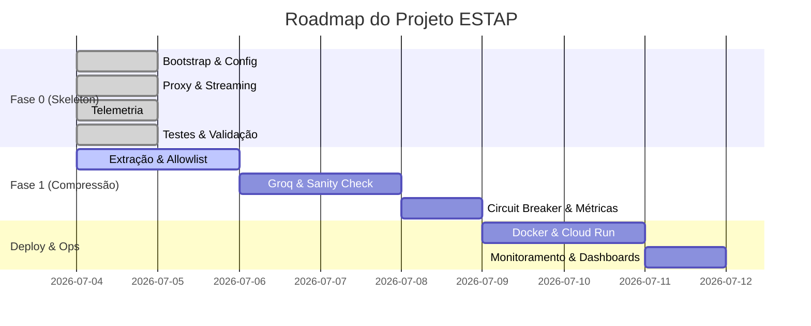

# 📊 ESTAP — Painel de Progresso do Desenvolvimento

Este documento rastreia em tempo real o andamento do desenvolvimento do projeto **Edge-Side Token Arbitrage Proxy (ESTAP)**.

## 🏁 Fase Atual: Fase 1 — Interceptação e Arbitragem Cross-Lingual (Concluída)
**Objetivo:** Ativar o motor de inteligência de borda. Implementar a extração de prompt do payload JSON da IDE, allowlist de código Markdown (Camada 1), chamada para a API Groq/Llama 3 para compressão semântica e tradução, sanity check de tamanho/integridade (Camada 2), circuit breaker com fail-open e logs segregados.

---

## 🗺️ Visão Geral do Roadmap



---

## 📝 Quadro de Tarefas

### 🟢 Sprint 1 — Fase 0: The Walking Skeleton (Concluída)
* [x] **0.7.1 — Arquivos do Gradle:** Criados `build.gradle.kts`, `settings.gradle.kts` e `gradle.properties`.
* [x] **0.7.2 — Ambiente e Ignore:** Criados `.gitignore`, `.env.example` e `.sdkmanrc`.
* [x] **0.7.3 — EnvironmentConfig.java:** Implementado com carregamento robusto via dotenv e validação de tipos.
* [x] **Wrapper do Gradle:** `gradlew` e diretório `gradle/` inicializados com sucesso após reconfiguração do daemon local.
* [x] **0.7.4 — EstapApplication.java:** Servidor Javalin configurado com rotas dinâmicas catch-all e endpoint `/estap/health`.
* [x] **0.7.5 — ProxyController.java:** Criado com lógica para reconstrução da URL de upstream, tratamento de headers e delegação.
* [x] **0.7.6 — StreamingRelay.java (Convencional):** Implementada a requisição síncrona com tratamento de headers e status.
* [x] **0.7.7 — StreamingRelay.java (SSE Streaming):** Adicionado suporte a Server-Sent Events com piping dinâmico e flushing imediato de buffers.
* [x] **0.7.8 — RequestMetrics & MetricsLogger:** Implementados dados imutáveis de requisição e serializador estruturado JSON.
* [x] **0.7.9 — Integração de Métricas:** Injetado rastreamento de latência total e de upstream no controller.
* [x] **0.7.10 — PayloadAnalyzer.java:** Implementada a anatomia de payload sem exposição de valores reais.
* [x] **0.7.11 — Testes Unitários:** Testes de EnvironmentConfig e MetricsLogger implementados e passando.
* [x] **0.7.12 — Testes de Integração com WireMock:** Validada toda a comunicação com upstream, mock de SSE e health checks.
* [x] **0.7.13 — Validação Final (Build Limpo):** Executado `./gradlew build` com sucesso.

### 🟢 Sprint 2 — Fase 1: Motor de Compressão (Concluída)
* [x] **1.13.1 — Configurações do Groq:** Atualizar `EnvironmentConfig` para carregar as chaves e endpoints do Groq.
* [x] **1.13.2 — PromptExtractor.java:** Implementar lógica para localizar o prompt do usuário com base na estrutura identificada no Payload Analyzer.
* [x] **1.13.3 — CodeBlockExtractor.java:** Implementar a extração e substituição de blocos de código Markdown por placeholders (Camada 1 do Sanity Check).
* [x] **1.13.5 — GroqCompressor.java:** Implementar o cliente de comunicação síncrona com a API Groq.
* [x] **1.13.6 — SanityCheck.java:** Implementar a validação matemática e de integridade dos placeholders (Camada 2).
* [x] **1.13.8 — FailOpenCircuitBreaker.java:** Implementar o circuit breaker com timeout rígido.
* [x] **1.13.11 — CompressionOrchestrator.java:** Coordenar o pipeline de extração, compressão, validação e recomposição.
* [x] **1.13.13 — Integração com ProxyController:** Conectar a orquestração de compressão ao fluxo do proxy local.
* [x] **1.13.14 — Testes de Integração da Fase 1:** Escrever os testes com mocks da API Groq e validações do circuit breaker.
* [x] **1.13.15 — Calibração do System Prompt:** Criar corpus de testes e calibrar o prompt de compressão para obter >30% de redução de tokens (Requer chaves reais da API Groq).
* [x] **1.13.16 — Ajustar GROQ_TIMEOUT_MS:** Calibrar o timeout final do circuit breaker baseado na telemetria empírica e latência do Groq.


---

## 🪵 Histórico de Incidentes e Resoluções (Log de Erros)

| Data/Hora | Componente/Tarefa | Descrição do Problema | Ação / Resolução | Status |
| :--- | :--- | :--- | :--- | :--- |
| 2026-07-04 12:18 | Gradle Wrapper | O daemon local do Gradle travou/ficou em cold start demorado na primeira execução. | Cancelado o processo travado, limpos os daemons residuais (`pkill`) e reexecutado com a flag `--no-daemon` pelo CLI do Antigravity. | **Resolvido** |
| 2026-07-04 12:31 | Estrutura de JDK | Garantia de que a versão de Java local não interfira com a versão do projeto. | Configurado Gradle Toolchain para Java 21 em `build.gradle.kts`, ativado auto-provisionamento em `gradle.properties` e gerado `.sdkmanrc` com `java=21-open`. | **Resolvido** |
| 2026-07-04 13:13 | Testes de Integração | `shouldProxyPostRequestIntact` falhou com `SocketTimeoutException` (timeout de leitura do OkHttp cliente). | 1. Configurado o `HttpClient` do JDK explicitamente para `HTTP_1_1` em `EstapApplication` para prevenir hangs de handshake/negociação HTTP/2 com mock servers. 2. Aumentado o timeout de leitura do cliente OkHttp nos testes de 5s para 30s para comportar a fase fria (cold-start/JIT) da JVM na primeira execução de teste da suíte. | **Resolvido** |

---

## 🔍 Como rodar o projeto localmente (Fase 0/1)

1. **Ajustar variáveis:** Copie `.env.example` para `.env` e defina suas chaves de API:
   ```bash
   cp .env.example .env
   ```
2. **Rodar os Testes:**
   ```bash
   ./gradlew test --no-daemon
   ```
3. **Executar a aplicação:**
   ```bash
   ./gradlew run --no-daemon
   ```
