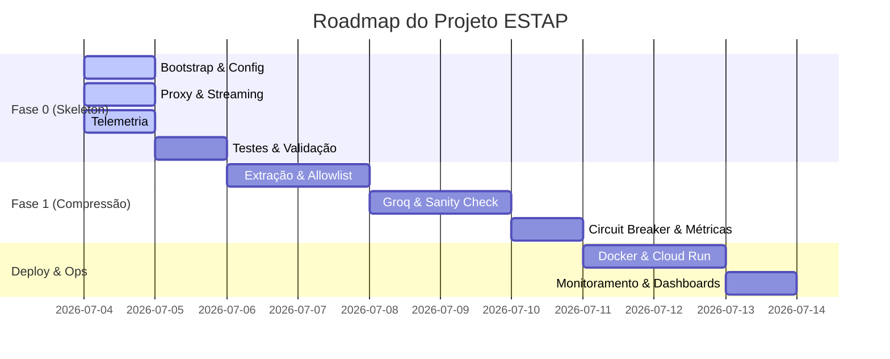

# 📊 ESTAP — Painel de Progresso do Desenvolvimento

Este documento rastreia em tempo real o andamento do desenvolvimento do projeto **Edge-Side Token Arbitrage Proxy (ESTAP)**.

## 🏁 Fase Atual: Fase 0 — The Walking Skeleton
**Objetivo:** Validar a infraestrutura de rede, interceptação transparente local, e piping assíncrono de SSE (Server-Sent Events) sem lógica de compressão.

---

## 🗺️ Visão Geral do Roadmap



---

## 📝 Quadro de Tarefas (Sprint 1 — Fase 0)

### 1. Bootstrap & Configuração
* [x] **0.7.1 — Arquivos do Gradle:** Criados `build.gradle.kts`, `settings.gradle.kts` e `gradle.properties`.
* [x] **0.7.2 — Ambiente e Ignore:** Criados `.gitignore`, `.env.example` e `.sdkmanrc`.
* [x] **0.7.3 — EnvironmentConfig.java:** Implementado com carregamento robusto via dotenv e validação de tipos.
* [x] **Wrapper do Gradle:** `gradlew` e diretório `gradle/` inicializados com sucesso após reconfiguração do daemon local.

### 2. Servidor e Proxy Passthrough
* [x] **0.7.4 — EstapApplication.java:** Servidor Javalin configurado com rotas dinâmicas catch-all e endpoint `/estap/health`.
* [x] **0.7.5 — ProxyController.java:** Criado com lógica para reconstrução da URL de upstream, tratamento de headers e delegação.
* [x] **0.7.6 — StreamingRelay.java (Convencional):** Implementada a requisição síncrona com tratamento de headers e status.
* [x] **0.7.7 — StreamingRelay.java (SSE Streaming):** Adicionado suporte a Server-Sent Events com piping dinâmico e flushing imediato de buffers.

### 3. Telemetria e Diagnóstico
* [x] **0.7.8 — RequestMetrics & MetricsLogger:** Implementados dados imutáveis de requisição e serializador estruturado JSON.
* [x] **0.7.9 — Integração de Métricas:** Injetado rastreamento de latência total e de upstream no controller.
* [x] **0.7.10 — PayloadAnalyzer.java:** Implementada a anatomia de payload sem exposição de valores reais.

### 4. Testes e Garantia de Qualidade
* [ ] **0.7.11 — Testes Unitários:** Escrever testes de componentes isolados (Config, Logger, Analyzer). (👉 **PRÓXIMO PASSO**)
* [ ] **0.7.12 — Testes de Integração com WireMock:** Validar o proxy local e SSE em cenário mockado.
* [ ] **0.7.13 — Validação Final (Build Limpo):** Executar `./gradlew build` com sucesso.

---

## 🪵 Histórico de Incidentes e Resoluções (Log de Erros)

| Data/Hora | Componente/Tarefa | Descrição do Problema | Ação / Resolução | Status |
| :--- | :--- | :--- | :--- | :--- |
| 2026-07-04 12:18 | Gradle Wrapper | O daemon local do Gradle travou/ficou em cold start demorado na primeira execução. | Cancelado o processo travado, limpos os daemons residuais (`pkill`) e reexecutado com a flag `--no-daemon` pelo CLI do Antigravity. | **Resolvido** |
| 2026-07-04 12:31 | Estrutura de JDK | Garantia de que a versão de Java local não interfira com a versão do projeto. | Configurado Gradle Toolchain para Java 21 em `build.gradle.kts`, ativado auto-provisionamento em `gradle.properties` e gerado `.sdkmanrc` com `java=21-open`. | **Resolvido** |

---

## 🔍 Como rodar o projeto localmente (Fase 0)

1. **Ajustar variáveis:** Copie `.env.example` para `.env` e defina suas chaves de API:
   ```bash
   cp .env.example .env
   ```
2. **Rodar os Testes (Pendente):**
   ```bash
   ./gradlew test
   ```
3. **Executar a aplicação:**
   ```bash
   ./gradlew run
   ```
