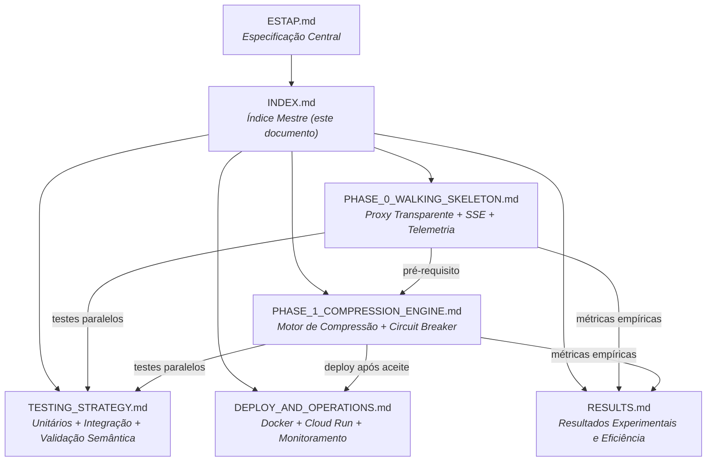

# ESTAP — Índice Mestre do Plano de Implementação

> **Documento central do projeto:** [ESTAP.md](file:///home/bertoni/Developer/projects/estap/ESTAP.md)
>
> Este índice organiza todos os documentos de implementação do projeto Edge-Side Token Arbitrage Proxy. Cada fase possui seu próprio documento com especificações técnicas detalhadas, algoritmos, contratos de API, critérios de aceite e checklists de execução.

---

## Mapa de Documentos

---

## Documentos de Fase

### [Fase 0 — The Walking Skeleton](file:///home/bertoni/Developer/projects/estap/docs/PHASE_0_WALKING_SKELETON.md)

Validação de infraestrutura. Proxy transparente sem lógica de compressão.

| Seção | Conteúdo |
|---|---|
| 0.1 — Bootstrap do Projeto | Gradle, dependências, estrutura de diretórios, `.env` |
| 0.2 — Servidor Javalin e Roteamento | Entry point, config, rota catch-all |
| 0.3 — Proxy Transparente | `ProxyController`, `StreamingRelay`, SSE piping, backpressure |
| 0.4 — Telemetria de Rede | `RequestMetrics`, `MetricsLogger`, Payload Anatomy (dev mode) |
| 0.5 — Health Check | Endpoint `/estap/health` para Cloud Run |
| 0.6 — Critérios de Aceite | 9 critérios com método de validação |
| 0.7 — Checklist de Implementação | 13 tarefas ordenadas |

**Entregáveis técnicos:**
- Proxy funcional com passthrough completo (request + response)
- SSE streaming token a token validado
- Linha de base de latência documentada
- Mapeamento do payload JSON da IDE (onde o prompt reside)

---

### [Fase 1 — Motor de Compressão Cross-Lingual](file:///home/bertoni/Developer/projects/estap/docs/PHASE_1_COMPRESSION_ENGINE.md)

Ativação da inteligência de borda. Tradução PT→EN e compressão semântica via Groq/Llama 3.

| Seção | Conteúdo |
|---|---|
| 1.1 — Novas Dependências | Variáveis de ambiente do Groq |
| 1.2 — Estrutura de Diretórios | Novos pacotes: `compression/`, `circuitbreaker/` |
| 1.3 — Extração do Prompt | `PromptExtractor` — localização do prompt no JSON |
| 1.4 — Allowlist de Imutabilidade (Camada 1) | `CodeBlockExtractor` — extração e proteção de blocos de código |
| 1.5 — Cliente Groq | `GroqCompressor` — API, system prompt, implementação |
| 1.6 — Sanity Check (Camada 2) | Validação de placeholders + validação matemática |
| 1.7 — Circuit Breaker Fail-Open | Timeout configurável, fallback transparente |
| 1.8 — Orquestrador de Compressão | Pipeline completo: extração → compressão → validação → reinserção |
| 1.9 — Modo Dry-Run | Before/after sem envio para a nuvem |
| 1.10 — Métricas de Compressão | Segregação obrigatória: sucesso vs fail-open |
| 1.11 — Integração no ProxyController | Fluxo atualizado com compressão |
| 1.12 — Critérios de Aceite | 10 critérios com método de validação |
| 1.13 — Checklist de Implementação | 16 tarefas ordenadas |

**Entregáveis técnicos:**
- Pipeline de compressão funcional com proteção de código
- Circuit breaker com fail-open validado
- Métricas segregadas (compressão vs fail-open)
- System prompt calibrado via dry-run (≥ 30% de compressão média)

---

### [Estratégia de Testes](file:///home/bertoni/Developer/projects/estap/docs/TESTING_STRATEGY.md)

Cobertura completa: unitários, integração e validação semântica semi-automatizada.

| Seção | Conteúdo |
|---|---|
| T.1 — Stack de Testes | JUnit 5, AssertJ, Mockito, WireMock, OkHttp |
| T.2 — Testes Unitários | 6 suítes com tabelas de casos por componente |
| T.3 — Testes de Integração | Setup com WireMock, 7 testes Fase 0, 7 testes Fase 1 |
| T.4 — Validação Semântica | Corpus de 20 prompts, script batch, critérios de aprovação |
| T.5 — Estrutura de Diretórios de Teste | Mapeamento completo `src/test/` |
| T.6 — Comandos de Execução | Gradle tasks para unitários, integração, cobertura |
| T.7 — Checklist de Testes | 16 tarefas ordenadas por fase |

**Entregáveis técnicos:**
- Suítes de teste executáveis para cada componente
- Corpus de 20+ prompts para validação empírica
- Script de batch dry-run com relatório consolidado

---

### [Deploy e Operações](file:///home/bertoni/Developer/projects/estap/docs/DEPLOY_AND_OPERATIONS.md)

Containerização, deploy no Cloud Run, gerenciamento de segredos e monitoramento.

| Seção | Conteúdo |
|---|---|
| D.1 — Dockerfile | Multi-stage build, Alpine, ZGC, usuário não-root |
| D.2 — Build e Teste Local | Comandos Docker para validação local |
| D.3 — Google Cloud Run | Artifact Registry, deploy, Secret Manager |
| D.4 — Configuração da IDE | URLs para dev local e produção |
| D.5 — Monitoramento | Cloud Logging queries, dashboard, alertas |
| D.6 — Logback Configuration | JSON estruturado para Cloud Logging |
| D.7 — Versionamento e Releases | Semver, fluxo de deploy |
| D.8 — Checklist de Deploy | 11 tarefas Fase 0, 7 tarefas Fase 1 |

**Entregáveis técnicos:**
- Container Docker otimizado e testado
- Cloud Run configurado com scale-to-zero
- Segredos no Secret Manager (zero hardcoded)
- Dashboard de monitoramento operacional

---

### [Resultados Experimentais e Eficiência](file:///home/bertoni/Developer/projects/estap/docs/RESULTS.md)

Evidências empíricas coletadas durante o desenvolvimento. Responde à pergunta: **"A proposta de valor do ESTAP se sustenta na prática?"**

| Seção | Conteúdo |
|---|---|
| 1 — Visão Geral | Hipótese central e diagrama do pipeline |
| 2 — Fase 0 | Cobertura de testes (18/18), critérios de aceite, incidentes e resoluções |
| 3 — Fase 1 | Cobertura de testes (29/29, acumulado 47/47), critérios de aceite |
| 4 — Calibração | Corpus de 20 prompts, tabela completa de resultados, iterações de engenharia de prompt |
| 5 — Análise Econômica | Estimativa de custo e economia com base nos dados empíricos |
| 6 — Log de Commits | Rastreabilidade por fase |
| 7 — Próximas Fases | Objetivos e métricas alvo |

**Achados principais:**
- Taxa de compressão média observada: **22,26%** (corpus de 20 prompts)
- 100% de compressões sem fail-open no corpus de calibração
- Latência warm do Groq: ~554 ms (P95 < 662 ms)
- Timeout do circuit breaker calibrado para **1000 ms**

---

## Stack Tecnológica Consolidada

| Camada | Tecnologia | Versão Mínima |
|---|---|---|
| Linguagem | Java | 21 |
| Build | Gradle (Kotlin DSL) | 8.x |
| Framework Web | Javalin | 6.x |
| HTTP Client | `java.net.http.HttpClient` | JDK built-in |
| JSON | Jackson Databind | 2.18.x |
| Logging | Logback + SLF4J | 1.5.x |
| Ambiente | dotenv-java | 3.x |
| Testes | JUnit 5, AssertJ, Mockito, WireMock, OkHttp | — |
| Container | Docker (Eclipse Temurin Alpine) | JDK/JRE 21 |
| Cloud | Google Cloud Run | — |
| Segredos | Google Secret Manager | — |
| Motor de Borda | Groq API (Llama 3 8B/70B) | — |

---

## Ordem Global de Execução

> A sequência abaixo define a ordem cronológica recomendada para o desenvolvimento completo do projeto.

### Sprint 1 — Fundação (Fase 0)

| # | Tarefa | Documento | Seção |
|---|---|---|---|
| 1 | Bootstrap Gradle + dependências | Fase 0 | 0.1 |
| 2 | `.gitignore`, `.env.example` | Fase 0 | 0.1 |
| 3 | `EnvironmentConfig` + testes | Fase 0 / Testes | 0.2 / T.2.1 |
| 4 | `EstapApplication` + health check | Fase 0 | 0.2 / 0.5 |
| 5 | `ProxyController` (passthrough) | Fase 0 | 0.3.1 |
| 6 | `StreamingRelay` (convencional) | Fase 0 | 0.3.2 |
| 7 | SSE streaming no `StreamingRelay` | Fase 0 | 0.3.2 |
| 8 | `RequestMetrics` + `MetricsLogger` | Fase 0 | 0.4 |
| 9 | Payload Anatomy (dev mode) | Fase 0 | 0.4.3 |
| 10 | Testes unitários Fase 0 | Testes | T.2.1, T.2.6 |
| 11 | Testes de integração Fase 0 | Testes | T.3.2 |
| 12 | Validação manual ponta a ponta | Fase 0 | 0.6 |

### Sprint 2 — Deploy Inicial (Fase 0)

| # | Tarefa | Documento | Seção |
|---|---|---|---|
| 13 | Dockerfile + `.dockerignore` | Deploy | D.1 |
| 14 | Build e teste local do container | Deploy | D.2 |
| 15 | Setup GCP (APIs, Artifact Registry) | Deploy | D.3.1 / D.3.2 |
| 16 | Push + deploy Cloud Run | Deploy | D.3.3 / D.3.4 |
| 17 | Secret Manager | Deploy | D.3.5 |
| 18 | Smoke test remoto | Deploy | D.7.2 |
| 19 | Configurar IDE → proxy remoto | Deploy | D.4 |
| 20 | Documentar linha de base de latência | Fase 0 | 0.4 |

### Sprint 3 — Motor de Compressão (Fase 1)

| # | Tarefa | Documento | Seção |
|---|---|---|---|
| 21 | Atualizar `EnvironmentConfig` (Groq vars) | Fase 1 | 1.1 |
| 22 | `PromptExtractor` + testes | Fase 1 / Testes | 1.3 / T.2.3 |
| 23 | `CodeBlockExtractor` + testes | Fase 1 / Testes | 1.4 / T.2.2 |
| 24 | `GroqCompressor` | Fase 1 | 1.5 |
| 25 | `SanityCheck` + testes | Fase 1 / Testes | 1.6 / T.2.4 |
| 26 | `FailOpenCircuitBreaker` + testes | Fase 1 / Testes | 1.7 / T.2.5 |
| 27 | `CompressionMetrics` | Fase 1 | 1.10 |
| 28 | `CompressionOrchestrator` | Fase 1 | 1.8 |
| 29 | Modo Dry-Run | Fase 1 | 1.9 |
| 30 | Integrar compressão no `ProxyController` | Fase 1 | 1.11 |
| 31 | Testes de integração Fase 1 | Testes | T.3.3 |

### Sprint 4 — Calibração e Produção (Fase 1)

| # | Tarefa | Documento | Seção |
|---|---|---|---|
| 32 | Criar corpus de 20+ prompts | Testes | T.4.1 |
| 33 | Implementar script de validação batch | Testes | T.4.2 |
| 34 | Sessão de calibração do system prompt | Fase 1 / Testes | 1.5.2 / T.4.3 |
| 35 | Ajustar `GROQ_TIMEOUT_MS` (dados da Fase 0) | Fase 1 | 1.7 |
| 36 | Rebuild + deploy com `DRY_RUN=true` | Deploy | D.8.14 |
| 37 | Validação dry-run no Cloud Run | Deploy | D.8.15 |
| 38 | Flip `DRY_RUN=false` (produção) | Deploy | D.8.16 |
| 39 | Configurar dashboard + alertas | Deploy | D.5.2 / D.5.3 |
| 40 | Monitorar 24h em produção | Deploy | D.8.17 |

---

## APIs Externas

| API | Propósito | Auth | Documentação |
|---|---|---|---|
| **Groq** | Motor de compressão (Llama 3) | Bearer token (`GROQ_API_KEY`) | https://console.groq.com/docs/api-reference |
| **Anthropic** (upstream) | Modelo principal (exemplo) | Bearer token (`UPSTREAM_API_KEY`) | https://docs.anthropic.com/en/api |
| **Google Gemini** (upstream) | Modelo principal (alternativo) | API key ou OAuth | https://ai.google.dev/api |

---

## Variáveis de Ambiente (Consolidação)

| Variável | Obrigatória | Fase | Descrição |
|---|---|---|---|
| `ESTAP_PORT` | Sim | 0 | Porta do servidor proxy |
| `UPSTREAM_BASE_URL` | Sim | 0 | URL base da API do modelo principal |
| `UPSTREAM_API_KEY` | Sim | 0 | Chave de API do modelo principal |
| `ESTAP_DEV_MODE` | Não | 0 | Habilita payload anatomy logging |
| `GROQ_API_KEY` | Sim | 1 | Chave de API do Groq |
| `GROQ_MODEL` | Sim | 1 | Modelo Groq a usar |
| `GROQ_API_URL` | Sim | 1 | URL da API Groq |
| `GROQ_TIMEOUT_MS` | Sim | 1 | Timeout do circuit breaker (ms) |
| `ESTAP_DRY_RUN` | Não | 1 | Modo dry-run (sem envio à nuvem) |
